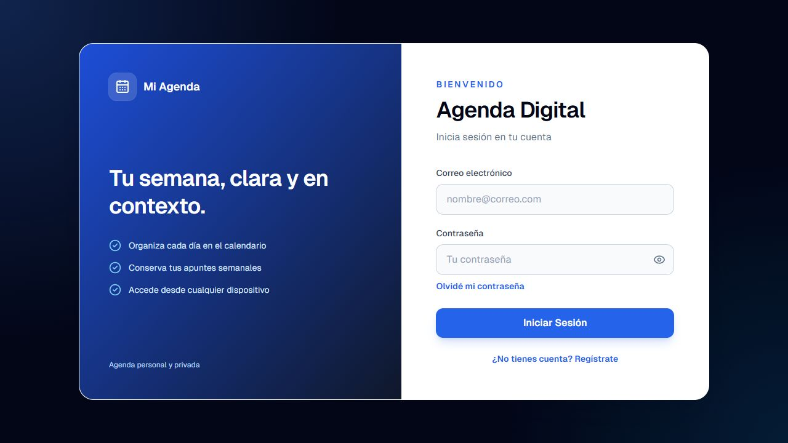
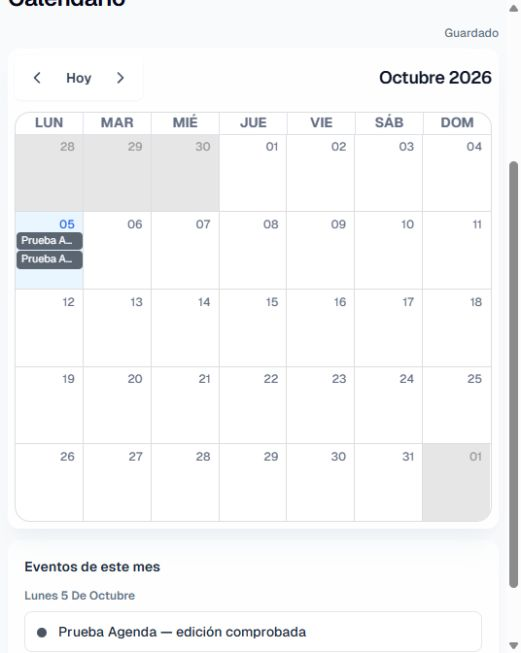
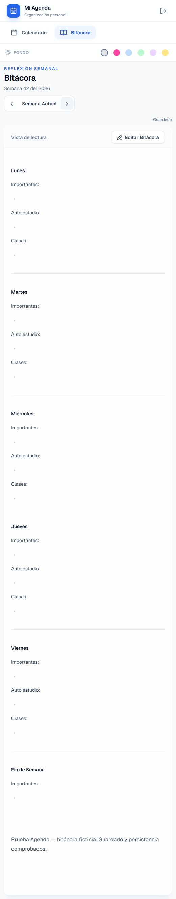

# Agenda Digital

Agenda personal instalable con calendario mensual y bitácora semanal, construida con Next.js, Supabase y TipTap.

## Funciones

- Calendario mensual para eventos y notas diarias.
- Bitácora semanal con editor enriquecido.
- Instalación como aplicación desde Chrome, Edge y navegadores compatibles con PWA.
- Lectura y edición sin conexión después de la primera visita.
- Sincronización automática de cambios al recuperar internet.
- Autenticación y datos privados mediante Supabase Row Level Security.

## Configuración local

1. Copia `.env.example` como `.env.local` y completa las credenciales públicas de Supabase.
2. Ejecuta `supabase/schema.sql` en un proyecto nuevo. Para una base existente, revisa y aplica las migraciones `20260903_harden_schema.sql`, `20260903_sync_auth_users.sql` y `20260903_allow_multiple_daily_events.sql`; no vuelvas a crear tablas existentes.
3. Instala y levanta la aplicación:

```bash
npm install
npm run dev
```

## Instalación y uso offline

En producción, abre la aplicación desde HTTPS e inicia sesión al menos una vez. Después puedes usar la opción **Instalar aplicación** del menú lateral o la opción de instalación del navegador.

Los meses y semanas visitados quedan disponibles en el dispositivo. Si editas sin conexión, la aplicación guarda los cambios localmente y los sincroniza cuando vuelve internet. Al cerrar sesión se eliminan los datos offline del dispositivo.

> La instalación PWA y el service worker se activan en el build de producción; durante `npm run dev` permanecen deshabilitados para evitar caché obsoleta.

## Despliegue en Vercel

Configura estas variables de entorno en el proyecto de Vercel:

```text
NEXT_PUBLIC_SUPABASE_URL
NEXT_PUBLIC_SUPABASE_ANON_KEY
```

Vercel ejecutará `npm run build`. El HTTPS del despliegue permite que el navegador ofrezca la instalación de la aplicación.

## Comprobaciones

```bash
npm run typecheck
npm run lint
npm run check:offline
npm run build
```

Las rutas bajo `/dashboard` requieren una sesión válida de Supabase. Row Level Security limita cada perfil, evento y bitácora a su propietario.

## Portafolio personal
Proyecto personal de **Ignacio Garrido**, Ingeniero en Informática titulado. Desarrollo propio de la aplicación; librerías, plantillas, datos e imágenes de terceros conservan su autoría.



Comprobados typecheck, lint y build con las rutas `/dashboard` y `/dashboard/journal` incluidas. La cola offline se comprobó con acciones de servidor simuladas: separación por usuario, reemplazo de cambios pendientes, conservación ante fallo, reintento y eliminación local. `supabase/check_rls.sql` aprobó en PostgreSQL local aislado la separación de perfiles/notas/bitácoras, rechazo de cambios ajenos, protección del correo y múltiples eventos por día; el bootstrap local simula auth.uid, no valida tokens de Supabase.

En el Supabase configurado se comprobó una sesión autenticada en navegador: creación y edición de eventos, dos eventos el mismo día, persistencia del calendario al recargar y guardado/recuperación de una bitácora semanal. Se usaron exclusivamente registros ficticios de prueba. Auth/PostgREST respondió HTTP 200 y el cliente anónimo no devolvió filas de usuarios/notas/bitácoras. Quedan pendientes la desconexión/reconexión real del navegador y el aislamiento entre dos cuentas contra Supabase; las pruebas locales anteriores no sustituyen esas comprobaciones.




